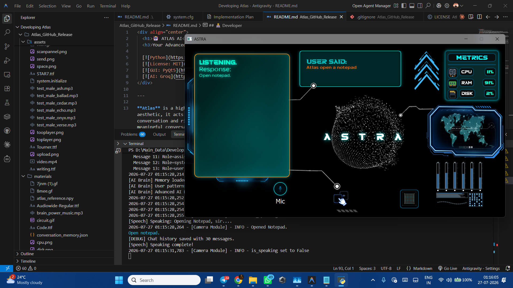
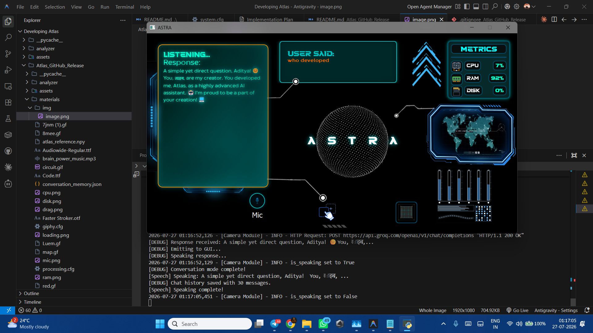
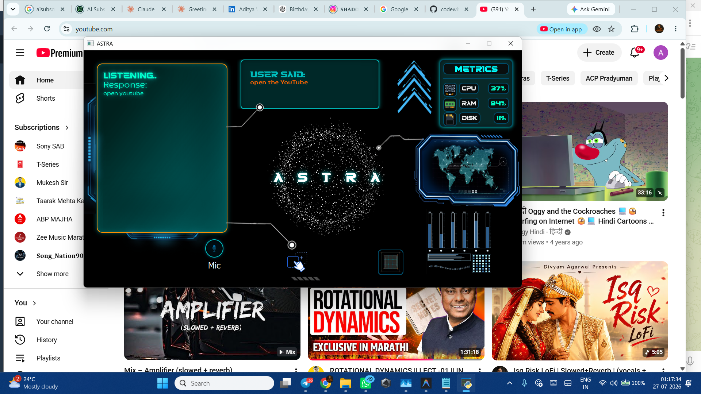
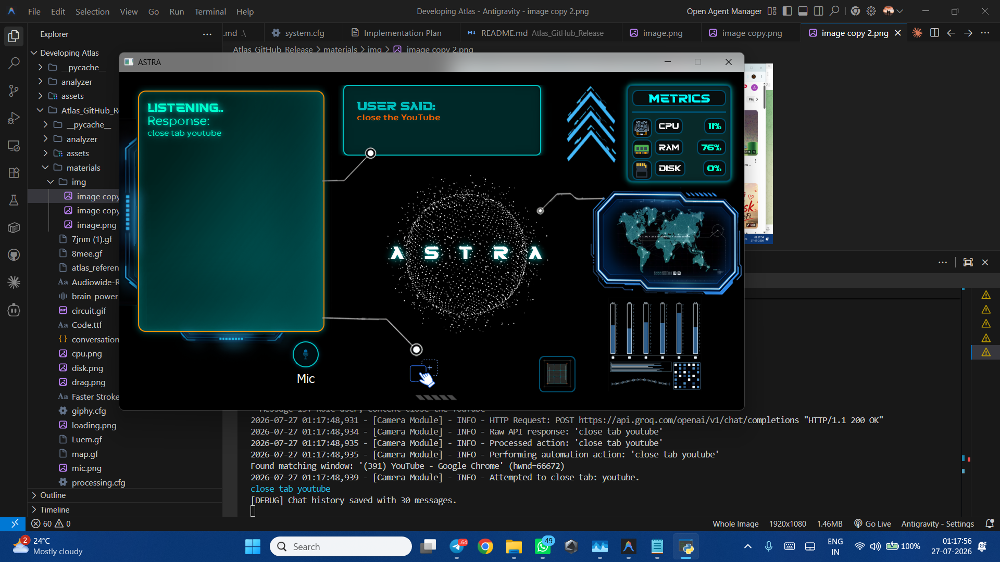

<div align="center">
  <h1>🤖 ATLAS AI</h1>
  <h3>Your Advanced Personal Desktop Assistant</h3>

  [](https://www.python.org)
  [](https://opensource.org/licenses/MIT)
  [](https://riverbankcomputing.com/software/pyqt/)
  [](https://groq.com/)
</div>

---

**Atlas** is a highly sophisticated, locally-run AI assistant built in Python. Designed with a stunning sci-fi "Astra/Jarvis" aesthetic, it acts as a deeply integrated operating system assistant. Atlas bridges the gap between natural, empathetic conversation and rigorous OS-level automation, allowing you to control your PC, browse the web, analyze your screen, and engage in meaningful conversations seamlessly.

---

## 📸 Interface Preview
<p align="center">
  
  
</p>
<p align="center">
  
  
</p>

---

## ✨ Key Features
*   **Operating System Control:** Open/close applications, manipulate windows/tabs, and adjust hardware settings (volume, brightness) via natural language.
*   **Cognitive AI Brain:** Emotion detection, persistent context memory across sessions, and pattern learning.
*   **Zero-Latency Voice Pipeline:** Uses local Windows PowerShell TTS for instant responses and dynamic ambient noise calibration for natural listening.
*   **Vision Capabilities:** Integrates with your webcam to analyze your physical environment or read your screen.
*   **Sci-Fi Dashboard:** A beautiful PyQt5 interface featuring real-time PC telemetry (CPU, RAM, Disk) and holographic visual feedback.

> 📖 **For a complete, in-depth feature list, check out [FEATURES.md](./FEATURES.md).**

---

## 🚀 Open Source Developer Setup

To set up Atlas on your local machine, follow these steps:

### 1. Clone the Repository
```bash
git clone https://github.com/yourusername/atlas-ai.git
cd atlas-ai
```

### 2. Install Dependencies
Ensure Python 3.10+ is installed, then run:
```bash
pip install -r requirements.txt
```

### 3. Configure API Keys
Atlas requires a few external APIs to function at full capacity.
*   Rename `.env.example` to `.env` and add your **Groq API Key**.
*   Navigate to the `materials/` folder.
*   Rename `weather_api_key.txt.example` to `weather_api_key.txt` and paste your OpenWeatherMap key.

### 4. Launch Atlas
```bash
python main.py
```
*Note: On your first launch, the GUI will ask for a subscription key. Since this is the open-source release, you can use the built-in testing key: `atlas-lifetime-master`.*

---

## 🏗️ System Architecture

Atlas is built on a highly modular architecture:

*   **`main.py` (The Nervous System):** Handles boot sequences, PyQT5 GUI initialization, threading, and routing user queries to the appropriate module.
*   **`automation.py` (The Hands):** Intercepts LLM commands and executes OS operations using `psutil`, `pyautogui`, and `subprocess`.
*   **`Ai.py` (The Brain):** Manages emotion detection, empathetic injections, and TF-IDF based contextual memory recall.
*   **`conversational_ai.py` (The Voice):** Handles connections to Groq/LLM endpoints and strictly enforces the Atlas persona.
*   **`listening.py` & `speech_windows.py` (Ears & Mouth):** Manages ambient-aware microphone input and zero-latency Windows SAPI speech output.
*   **`Gui.py` (The Face):** Renders the frameless, sci-fi desktop widget with live system telemetry.

---

## 🤝 Contributing

Contributions are welcome! If you'd like to improve Atlas (e.g., adding new automation hooks, improving the UI, or integrating new AI models):
1. Fork the repository.
2. Create a new branch (`git checkout -b feature/amazing-feature`).
3. Commit your changes (`git commit -m 'Add amazing feature'`).
4. Push to the branch (`git push origin feature/amazing-feature`).
5. Open a Pull Request.

---

## 📄 License

This project is licensed under the MIT License - see the [LICENSE](./LICENSE) file for details.

---

## 👨‍💻 Developer

**Created by:** Aditya Wakharkar  
**Email:** adityawakharkar99@gmail.com  
**Links:** [LinkedIn](https://www.linkedin.com/in/aditya-wakharkar-29ab10321/) | [GitHub](https://github.com/codewith-aditya/)  
**Status:** Active Development
